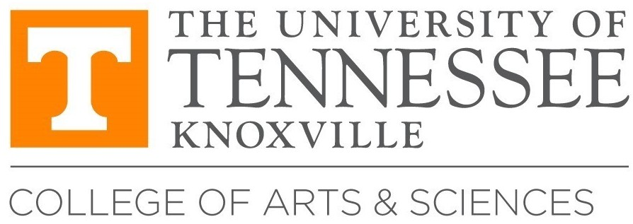

# Open Science

## Overview

The Open Science Workshop and Symposium is sponsored by the [College of Arts and Sciences](https://artsci.utk.edu) at the University of Tennessee, Knoxville. It aims to promote transparency, reproducibility, and accessibility in research through open science principles.

## Workshop Schedule

The virtual workshop will be held weekly on Mondays from 10-11 AM ET in March 2025, covering the following topics:

| Date           | Topic           | Description                                                          |
| -------------- | --------------- | -------------------------------------------------------------------- |
| March 10, 2025 | Open Code       | Best practices for sharing and collaborating on code.                |
| March 17, 2025 | Open Data       | Principles and tools for making research data openly available.      |
| March 24, 2025 | Open Results    | Ensuring transparency and reproducibility in research findings.      |
| March 31, 2025 | Open Publishing | Strategies for disseminating research through open-access platforms. |

The workshop will be conducted via Zoom. The registration link will be provided soon.

## Symposium

The in-person symposium will feature external speakers discussing various aspects of open science, sharing insights, and fostering collaboration.

- **Location**: The Lindsay Young Auditorium in [John C. Hodges Library](https://maps.utk.edu/?id=314#!m/276034?share), University of Tennessee, Knoxville
- **Date & Time**: April 3, 2025, 3:30 - 4:00 PM ET (Reception), 4:00 - 5:15 PM ET (Symposium)
- **Registration**: Details coming soon.

## Contact

For inquiries, please reach out to Dr. [Qiusheng Wu](https://geography.utk.edu/people/instructional-faculty/wu-qiusheng) at qwu18@utk.edu.
